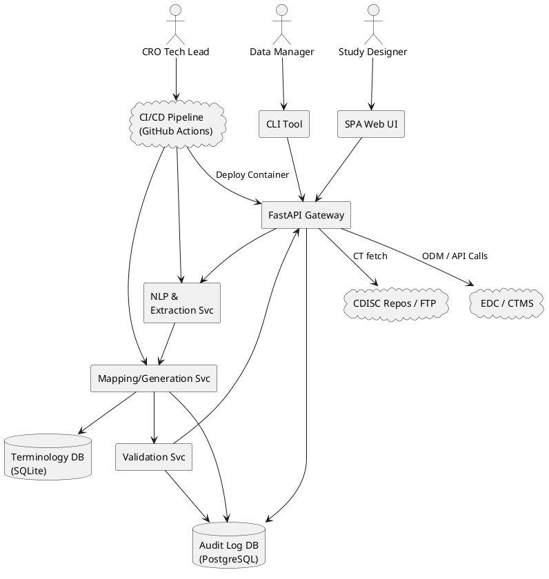

# ADR 0001: Choosing System Architecture for **Protocol to CRF Generator**

## Status  
Accepted – initial baseline for the project

## Date  
2025‑07‑15

## Context  
The *Protocol to CRF Generator* must transform heterogeneous clinical‑study protocols into validated, CDISC‑compliant Case Report Form artefacts.  Key contextual forces include:

* **Regulated environment** – 21 CFR Part 11 auditability and strict SDLC controls.  
* **Multiple personas & interfaces** – Data managers script via CLI, study designers prefer a Web UI, integrators call a REST API.  
* **Standards drift** – quarterly CDISC CT releases and evolving ODM/CDASH specs.  
* **Performance & maintainability** – NLP pipelines, mapping logic and validation rules must remain modular, testable and easy to evolve.  
* **Deployment diversity** – CROs may run on‑prem GxP Kubernetes, while smaller teams pull a Docker image or use a hosted SaaS instance.

## Decision Drivers
1. **Regulatory compliance & traceability** (immutable audit trail, separation of dev/test/prod).  
2. **Loose coupling & focused deployables** to support CLI, API and optional SPA without monolith bloat.  
3. **Portability** across laptops, CI, and validated cloud via container images.  
4. **Scalability of NLP/validation workloads** (CPU‑bound tasks parallelised independently of thin UI edges).  
5. **Open‑source governance** – clear boundaries between core engine and value‑add wrappers.

## Considered Options
| ID | Option | Brief Description |
|----|--------|-------------------|
| A | **Containerised modular service** | Core FastAPI service, NLP & mapping workers, thin CLI & SPA as clients; packaged via Docker Compose/K8s. |
| B | **Single desktop/monolith** | Fat Python/Qt application shipping engine + UI in one executable. |
| C | **Pure serverless (FaaS)** | Decompose every step into cloud functions triggered by file uploads; UI/API are thin orchestrators. |

## Decision Outcome
**Chosen option A – Containerised modular service**.

### Rationale
* Aligns with Technical Plan (FastAPI, CLI, optional SPA, GitHub Actions, Docker).  
* Supports GxP validation via reproducible images & immutable tags.  
* Enables horizontal scaling of compute‑heavy NLP/validation pods independent of UI.  
* Simplifies local adoption (one `docker compose up`) and enterprise deployment (Helm/K8s).  
* Clear seams for future open‑source/community contributions.

## Pros & Cons of the Options
| Option | Pros | Cons |
|--------|------|------|
| A – Modular service | ✦ Meets all drivers; ✦ Easy CI/CD; ✦ Fine‑grained scalability; ✦ Clean separation of concerns | ‑ Slightly higher operational complexity vs desktop; ‑ Requires container skills for on‑prem installs |
| B – Desktop monolith | ✦ Simplest to run offline; ✦ No server infra | ‑ Poor multi‑user story; ‑ Hard to validate/CI; ‑ Difficult to integrate with EDC systems |
| C – Serverless | ✦ Auto‑scales; ✦ Pay‑per‑use | ‑ Vendor lock‑in; ‑ Complex distributed tracing; ‑ Challenging to meet Part 11 audit‑trail requirements |

## Consequences
* **Architecture baseline**: All components expose gRPC/REST contracts; internal services share a Pydantic‑based domain model.  
* **Deployment**: Official Docker images, Helm charts, and GitHub Actions workflows become part of the validated configuration.  
* **Compliance hooks**: Central Audit‑Log DB captures every API + data‑pipeline event; images are cryptographically signed and versioned.  
* **Future extensions**: Additional importers (FHIR ResearchStudy) or rules‑engines (CDISC CORE) slot in as side‑car containers.

## Architectural Views

## Links
* *Technical & Requirements Specification for an Automated, CDISC‑Compliant CRF Generation System* – source for assumptions.  
* CI/CD workflow definition `.github/workflows/main.yml` once implemented.

