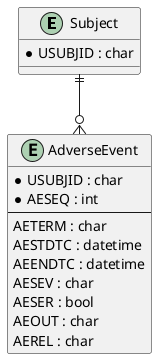

# Adverse Events (AE) ER Model

_Generated on 2025-07-15_

## Overview

The Adverse Events (AE) domain catalogs any untoward medical occurrences that develop or worsen after treatment administration, enabling comprehensive safety surveillance.

## Entities

| Entity Name | Attributes (PK, FK) | Description |
|-------------|---------------------|-------------|
| **Subject** | USUBJID (PK) | Unique trial participant. |
| **AdverseEvent** | USUBJID (PK, FK), AESEQ (PK), AETERM, AESTDTC, AEENDTC, AESEV, AESER, AEOUT, AEREL | Adverse event episode. |

## PlantUML

