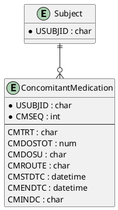

# Concomitant Medications (CM) ER Model

_Generated on 2025-07-15_

## Overview

The Concomitant Medications (CM) domain tracks any drugs or treatments a subject receives in addition to study therapy, providing essential context for safety analyses.

## Entities

| Entity Name | Attributes (PK, FK) | Description |
|-------------|---------------------|-------------|
| **Subject** | USUBJID (PK) | Study participant. |
| **ConcomitantMedication** | USUBJID (PK, FK), CMSEQ (PK), CMTRT, CMDOSTOT, CMDOSU, CMROUTE, CMSTDTC, CMENDTC, CMINDC | Medication episode details. |

## PlantUML

