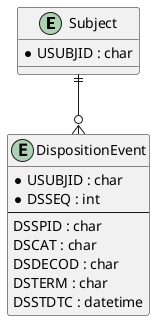

# Disposition (DS) ER Model

_Generated on 2025-07-15_

## Overview

The Disposition (DS) domain captures milestone decisions and outcomes—such as screening status, treatment completion, or study withdrawal—for every subject.

## Entities

| Entity Name | Attributes (PK, FK) | Description |
|-------------|---------------------|-------------|
| **Subject** | USUBJID (PK) | Study participant. |
| **DispositionEvent** | USUBJID (PK, FK), DSSEQ (PK), DSSPID, DSCAT, DSDECOD, DSTERM, DSSTDTC | Disposition milestone. |

## PlantUML

