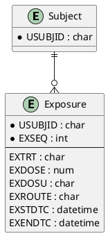

# Exposure (EX) ER Model

_Generated on 2025-07-15_

## Overview

The Exposure (EX) domain describes the actual study treatment a subject receives, including dose, timing, and route—distinct from planned dosing.

## Entities

| Entity Name | Attributes (PK, FK) | Description |
|-------------|---------------------|-------------|
| **Subject** | USUBJID (PK) | Participant receiving study intervention. |
| **Exposure** | USUBJID (PK, FK), EXSEQ (PK), EXTRT, EXDOSE, EXDOSU, EXROUTE, EXSTDTC, EXENDTC | Delivered treatment record. |

## PlantUML

