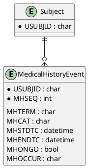

# Medical History (MH) ER Model

_Generated on 2025-07-15_

## Overview

The Medical History (MH) domain records clinically relevant conditions that pre‑date study baseline, offering context for efficacy and safety evaluations.

## Entities

| Entity Name | Attributes (PK, FK) | Description |
|-------------|---------------------|-------------|
| **Subject** | USUBJID (PK) | Trial participant. |
| **MedicalHistoryEvent** | USUBJID (PK, FK), MHSEQ (PK), MHTERM, MHCAT, MHSTDTC, MHENDTC, MHONGO, MHOCCUR | Historical condition. |

## PlantUML

