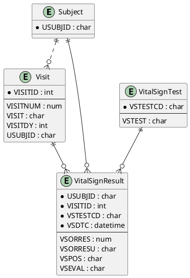

# Vital Signs (VS) ER Model

_Generated on 2025-07-15_

## Overview

The Vital Signs (VS) domain records repeated physiological measurements—such as blood pressure, temperature, and weight—captured at planned study visits.

## Entities

| Entity Name | Attributes (PK, FK) | Description |
|-------------|---------------------|-------------|
| **Subject** | USUBJID (PK) | Unique trial participant. |
| **Visit** | VISITID (PK), USUBJID (FK), VISITNUM, VISIT, VISITDY | Scheduled assessment window. |
| **VitalSignTest** | VSTESTCD (PK), VSTEST | Controlled list of vital‑sign tests. |
| **VitalSignResult** | USUBJID (PK, FK), VISITID (PK, FK), VSTESTCD (PK, FK), VSDTC (PK), VSORRES, VSORRESU, VSPOS, VSEVAL | Individual measurement result. |

## PlantUML

