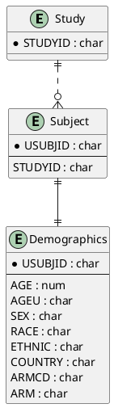

# Demographics (DM) ER Model

_Generated on 2025-07-15_

## Overview

The Demographics (DM) domain captures immutable baseline characteristics for every subject enrolled in the clinical study. These attributes—such as age, sex, race, and randomization group—are collected once (typically at screening) and reused throughout analysis and reporting.

## Entities

| Entity Name | Attributes (PK, FK) | Description |
|-------------|---------------------|-------------|
| **Study** | STUDYID (PK) | Protocol-level identifier that groups all subjects. |
| **Subject** | USUBJID (PK), STUDYID (FK) | Unique subject enrolled in the study. |
| **Demographics** | USUBJID (PK, FK), AGE, AGEU, SEX, RACE, ETHNIC, COUNTRY, ARMCD, ARM | Baseline demographic attributes. |

## PlantUML

