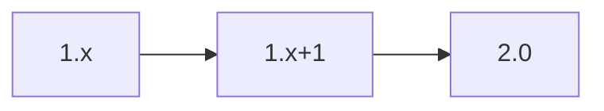

# API Contract – CLI Wrapper

This service exposes a thin HTTP interface used by the command-line client. It mirrors the gateway policies from the [Technical Plan](../../technical-plan.md).

## OpenAPI 3.1 Stub
```yaml
openapi: 3.1.0
info:
  title: CLI Wrapper
  version: 0.1.0
paths:
  /run:
    post:
      summary: Execute a CLI job
      requestBody:
        required: true
        content:
          application/json:
            schema:
              $ref: '#/components/schemas/RunRequest'
      responses:
        '200':
          description: Result
          content:
            application/json:
              schema:
                $ref: '#/components/schemas/RunResult'
        default:
          description: Error
          content:
            application/json:
              schema:
                $ref: '#/components/schemas/ErrorObject'
components:
  schemas:
    RunRequest:
      type: object
      properties:
        command:
          type: string
      required: [command]
    RunResult:
      type: object
      properties:
        exit_code:
          type: integer
        output:
          type: string
      required: [exit_code, output]
    ErrorObject:
      type: object
      properties:
        code:
          type: string
        message:
          type: string
      required: [code, message]
x-versioning-policy: |
  Semantic Versioning 2.0 with one MINOR release grace period for deprecated arguments.
```

## Versioning & Deprecation Timeline

