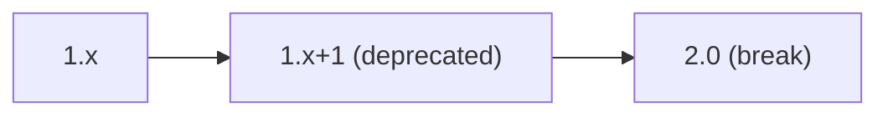

# API Contract – FastAPI Gateway

This contract defines the public REST endpoints exposed by the FastAPI gateway component. It aligns with the principles outlined in the [CDISC CRF Generation Technical Plan](../../technical-plan.md).

## OpenAPI 3.1 Stub
```yaml
openapi: 3.1.0
info:
  title: FastAPI Gateway
  version: 0.1.0
paths:
  /ingest:
    post:
      summary: Queue protocol ingestion
      requestBody:
        required: true
        content:
          application/json:
            schema:
              $ref: '#/components/schemas/ProtocolInput'
      responses:
        '202':
          description: Job accepted
          content:
            application/json:
              schema:
                $ref: '#/components/schemas/JobStatus'
        '4XX':
          description: Client error
          content:
            application/json:
              schema:
                $ref: '#/components/schemas/ErrorObject'
components:
  schemas:
    ProtocolInput:
      type: object
      properties:
        filename:
          type: string
        content:
          type: string
      required: [filename, content]
    JobStatus:
      type: object
      properties:
        job_id:
          type: string
        state:
          type: string
      required: [job_id, state]
    ErrorObject:
      type: object
      properties:
        code:
          type: string
        message:
          type: string
      required: [code, message]
x-versioning-policy: |
  Semantic Versioning 2.0. Paths remain backward compatible within a MAJOR version.
  Deprecated endpoints are supported for one MINOR release before removal.
```

## Versioning & Deprecation Timeline

