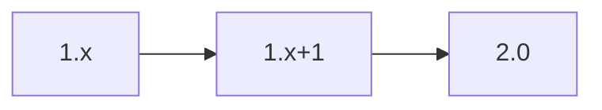

# API Contract – Mapping Generation Service

This microservice converts extracted study requirements into CDISC-compliant CRF artefacts. Design principles follow the [Technical Plan](../../CDISC%20CRF%20Generation%20Technical%20Plan_.md).

## OpenAPI 3.1 Stub
```yaml
openapi: 3.1.0
info:
  title: Mapping Generation Service
  version: 0.1.0
paths:
  /map:
    post:
      summary: Map canonical study requirements
      requestBody:
        required: true
        content:
          application/json:
            schema:
              $ref: '#/components/schemas/MappingRequest'
      responses:
        '200':
          description: Mapping result
          content:
            application/json:
              schema:
                $ref: '#/components/schemas/MappingResult'
        default:
          description: Error
          content:
            application/json:
              schema:
                $ref: '#/components/schemas/ErrorObject'
components:
  schemas:
    MappingRequest:
      type: object
      properties:
        ir_id:
          type: string
      required: [ir_id]
    MappingResult:
      type: object
      properties:
        crf_id:
          type: string
      required: [crf_id]
    ErrorObject:
      type: object
      properties:
        code:
          type: string
        message:
          type: string
      required: [code, message]
x-versioning-policy: |
  Semantic Versioning 2.0. Deprecations remain one MINOR release.
```

## Versioning & Deprecation Timeline

