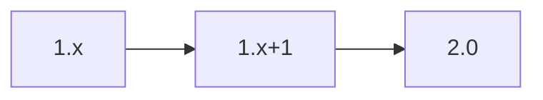

# API Contract – NLP Extraction Service

The NLP service extracts entities from protocol text. Contracts comply with the [Technical Plan](../../technical-plan.md).

## OpenAPI 3.1 Stub
```yaml
openapi: 3.1.0
info:
  title: NLP Extraction Service
  version: 0.1.0
paths:
  /extract:
    post:
      summary: Extract entities
      requestBody:
        required: true
        content:
          application/json:
            schema:
              $ref: '#/components/schemas/ExtractionRequest'
      responses:
        '200':
          description: Extraction result
          content:
            application/json:
              schema:
                $ref: '#/components/schemas/ExtractionResult'
        default:
          description: Error
          content:
            application/json:
              schema:
                $ref: '#/components/schemas/ErrorObject'
components:
  schemas:
    ExtractionRequest:
      type: object
      properties:
        text:
          type: string
      required: [text]
    ExtractionResult:
      type: object
      properties:
        entities:
          type: array
          items:
            type: object
      required: [entities]
    ErrorObject:
      type: object
      properties:
        code:
          type: string
        message:
          type: string
      required: [code, message]
x-versioning-policy: |
  Semantic Versioning 2.0. A deprecated model remains available for one MINOR release.
```

## Versioning & Deprecation Timeline

