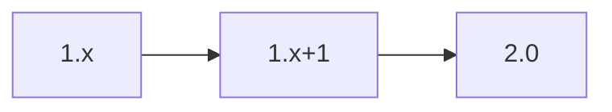

# API Contract – Validation Service

The validation microservice checks generated CRFs for standards compliance. It uses the interfaces defined in the [Technical Plan](../../technical-plan.md).

## OpenAPI 3.1 Stub
```yaml
openapi: 3.1.0
info:
  title: Validation Service
  version: 0.1.0
paths:
  /validate:
    post:
      summary: Validate CRF artefact
      requestBody:
        required: true
        content:
          application/json:
            schema:
              $ref: '#/components/schemas/ValidationRequest'
      responses:
        '200':
          description: Validation result
          content:
            application/json:
              schema:
                $ref: '#/components/schemas/ValidationResult'
        default:
          description: Error
          content:
            application/json:
              schema:
                $ref: '#/components/schemas/ErrorObject'
components:
  schemas:
    ValidationRequest:
      type: object
      properties:
        crf_id:
          type: string
      required: [crf_id]
    ValidationResult:
      type: object
      properties:
        status:
          type: string
      required: [status]
    ErrorObject:
      type: object
      properties:
        code:
          type: string
        message:
          type: string
      required: [code, message]
x-versioning-policy: |
  Semantic Versioning 2.0. Deprecated checks remain one MINOR release.
```

## Versioning & Deprecation Timeline

