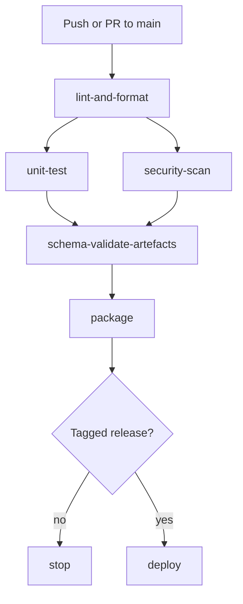

# CI/CD Pipeline Blueprint

This blueprint expands on Section 2.3 of the [CDISC CRF Generation Technical Plan](../../technical-plan.md). The pipeline is implemented with **GitHub Actions** and provides the auditable SDLC required for 21 CFR Part 11 compliance.

## Workflow Triggers
- **Push / Pull Request** to `main` trigger the primary workflow defined in `.github/workflows/main.yml`.
- **Tagged Release** on `main` additionally runs the deploy job to publish artefacts.
- **Scheduled Weekly** workflow polls the NCI‑EVS FTP site for new Controlled Terminology (CT) releases and auto‑opens a PR if updates are found.

## Job Sequence
1. **lint-and-format** – runs `ruff` and `mypy --strict`. Fails fast on any style or type errors.
2. **unit-test** – executes `pytest` with `pytest-cov`; uploads coverage reports and enforces ≥90% coverage.
3. **security-scan** – runs `bandit` and `semgrep` in parallel to detect vulnerabilities.
4. **schema-validate-artefacts** – generates sample ODM‑XML/JSON via the CLI and validates them against cached CDISC schemas.
5. **package** – builds the Python sdist/wheel and Docker image; stores both as workflow artefacts.
6. **deploy** *(release tags only)* – publishes the package to PyPI using Trusted Publishing and pushes the Docker image to the container registry.

## Artefact Handling & Notifications
- Build artefacts are uploaded using the `actions/upload-artifact` action.
- Deployment jobs fetch these artefacts for publishing.
- Workflow status badges and notifications (e.g., Slack or email) can be configured via existing GitHub Actions integrations.

## Mermaid Flowchart

The combination of automated checks, artefact promotion and explicit release gating ensures every change is tested, secure and traceable before production deployment.
