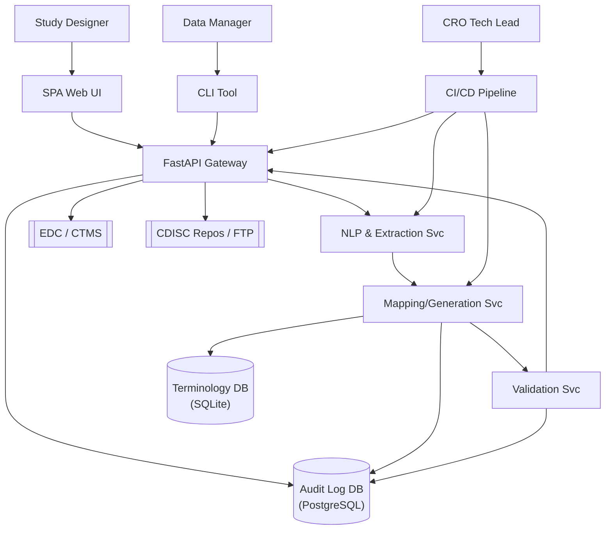

# Title & Metadata

**Project:** Protocol to CRF Generator – instantly convert study protocols to CDISC-compliant eCRF artefacts.

**Authors:** Project Lead (Frederick de Ruiter)

**Last Updated:** 2025-07-15

**Primary Reviewers:** Frederick de Ruiter

---

## Context / Problem Statement
The project aims to reduce manual CRF build effort from eight hours to under one hour by automating extraction, mapping and validation of protocol content. As described in the [Project Charter](1_Vision & Scope/1_Project Charter + Vision Statement/project_charter.md), the lightweight CLI/API should deliver validated CRF artefacts in minutes using only open‑source tooling. Key metrics include a turnaround time of **≤15 minutes** and mapping accuracy **≥90 %** across a regression corpus.

---

## Goals (✓)
- Support DOCX/PDF protocol ingestion with automatic section detection and CSV table extraction. [Functional Spec](2_Requirements/1_Functional Spec or User-Story Backlog/functional_spec_protocol_ingestion.md)
- Extract visits, assessments and timing entities with confidence ≥0.8 and capture provenance metadata.
- Persist validated **StudyProtocolIR** JSON with a SHA‑256 manifest.
- Provide both a command‑line interface and a containerised REST API. [Feature List](2_Requirements/1_Functional Spec or User-Story Backlog/z_feature_list.md)
- Generate CDASH v2.1 mapped ODM‑XML/JSON and Markdown CRFs.
- Publish Docker images and PyPI packages on tagged releases with GitHub Actions.

---

## Non-Goals (✗)
- Part 11 validated hosting or paid support is explicitly out of scope. [Project Charter](1_Vision & Scope/1_Project Charter + Vision Statement/project_charter.md)
- Direct EDC database build/upload and SDTM conversion are not addressed in this phase.
- Multi-user role-based access control will be considered later.
- FHIR ResearchStudy importer is only a future-proof hook.

---

## High-Level Solution Overview
The system is a modular set of Docker containers orchestrated by GitHub Actions and deployable via Docker Compose or Kubernetes. A FastAPI gateway coordinates ingestion, NLP extraction, mapping, generation and validation services. Users interact through a CLI, REST API or optional web UI. The architecture below is adapted from [ADR‑0001](3_Architecture & Design/1_High-Level Architecture Diagram & ADRs/adr-0001-system-architecture.md).

---

## Detailed Design & Architecture
### Components
- **FastAPI Gateway** exposes `/ingest` and orchestrates background jobs.
- **NLP Extraction Service** processes text via `/extract`.
- **Mapping Generation Service** maps IR IDs via `/map`.
- **Validation Service** validates CRF artefacts via `/validate`.
- **CLI Wrapper Service** offers `/run` for invoking CLI jobs remotely.
- **Terminology DB (SQLite)** stores controlled terminology used during mapping.
- **Audit Log DB (PostgreSQL)** records every API call and pipeline event.

### Data Models
- **AE, CM, DM, DS, EX, MH, VS domains** each include `Subject` plus domain-specific entities such as `AdverseEvent`, `ConcomitantMedication`, `Demographics`, `DispositionEvent`, `Exposure`, `MedicalHistoryEvent` and `VitalSignResult`. Each ER model was generated on 2025‑07‑15 and includes PlantUML diagrams for relationships.

### API Contracts
- **CLI Wrapper** – `POST /run` accepts `RunRequest{command}` and returns `RunResult{exit_code, output}`. Deprecated arguments are supported for one minor release.
- **FastAPI Gateway** – `POST /ingest` accepts `ProtocolInput{filename, content}` and returns `JobStatus{job_id, state}`.
- **NLP Extraction Service** – `POST /extract` takes `ExtractionRequest{text}` and returns `ExtractionResult{entities[]}`.
- **Mapping Generation Service** – `POST /map` consumes `MappingRequest{ir_id}` and returns `MappingResult{crf_id}`.
- **Validation Service** – `POST /validate` consumes `ValidationRequest{crf_id}` and returns `ValidationResult{status}`.
All APIs follow Semantic Versioning 2.0 with deprecated endpoints kept for one minor release.

---

## Dependencies & Integration Points
- External libraries: spaCy, medspaCy, FastAPI, Pydantic, PlantUML, pytest. [Third‑Party Inventory](7_Governance & Compliance/1_License & Third-Party Software Inventory/third-party-inventory.md)
- GitHub Actions for CI/CD pipelines and cron-based CT updates.
- CDISC Controlled Terminology (NCI-EVS FTP) used during mapping.
- Optional integration with EDC/CTMS systems via exported ODM files.
- Feature flags: optional SPA Web UI, optional FHIR importer.

---

## Security, Privacy, Performance & Reliability
- **Threat Mitigations:** TLS for all traffic, MFA for maintainer accounts, container isolation, and immutable audit logs as described in the [Threat Model](7_Governance & Compliance/2_Security & Privacy Threat Model/threat-model.md).
- **Performance Targets:** End‑to‑end CRF build ≤5 min median and ≤7 min P95; API latency ≤200 ms P95 under 500 users; memory per worker ≤1 GB. [NFR Checklist](2_Requirements/2_Non-Functional Requirements (NFR) Sheet/nfr_checklist.md)
- **Reliability Goals:** Service uptime ≥99.9 %, task queue drains 100 jobs within 5 min, disaster recovery RTO ≤4 h and RPO ≤15 min.
- **Security Controls:** RBAC coverage ≥95 % unit-test verified, zero critical CVEs, encrypted transport and storage achieving Qualys grade A+.

---

## Trade-offs & Alternatives Considered
**Decision Drivers** (from [ADR‑0001](3_Architecture & Design/1_High-Level Architecture Diagram & ADRs/adr-0001-system-architecture.md))
1. Regulatory compliance & traceability
2. Loose coupling to support CLI, API and SPA
3. Portability via containers
4. Scalable NLP/validation workloads
5. Open-source governance boundaries

**Rejected Alternatives**
- **Desktop monolith** – simple offline usage but poor multi-user story and hard to integrate with EDC.
- **Serverless FaaS** – auto-scaling but high vendor lock‑in and difficult audit-trail compliance.

---

## Risks & Mitigations
- **R1:** Non-compliance with 21 CFR Part 11 – mitigate via immutable audit logs and CI/CD checks.
- **R2:** Inaccurate NLP extraction – use rule-based spaCy pipelines and regression corpus.
- **R3:** Terminology updates breaking mappings – automate CT update process with regression tests.
- **R4:** Security vulnerabilities in dependencies – run Bandit and Semgrep; use dependable tooling.
- **R5:** Limited developer bandwidth – prioritise backlog and encourage community contributions.

---

## Testing & Validation Plan
- Unit, integration and regression tests executed via `pytest` with coverage ≥90 % enforced.
- GitHub Actions runs lint, type check, security scans and container-based tests on every PR.
- Performance, security and compliance checks form part of the regression suite.
- Definition of Done requires passing CI, updated docs and peer review.

---

## Rollout Plan
Rollout follows the quarterly roadmap: foundation in Q1 (CI/CD, core NLP, CLI), expanded domains and REST API in Q2, Web UI and advanced importers in Q3, culminating in v1.0 release Q4. Deployments use the GitHub Actions pipeline described above and follow the [Deployment Runbook](5_Quality & Ops/4_Deployment & Rollback Runbook/runbook-deploy-rollback.md) with health checks and rollback steps (`docker-compose down`, pull previous image, `alembic downgrade -1`).

---

## Future Work
- Implement FHIR ResearchStudy importer once HL7 adoption stabilises.
- Train statistical NER models and integrate CDISC CORE validation (planned for Q3).
- Establish governance framework and steering document for future CDISC versions.
- Expand multi-user RBAC and validated hosting beyond the initial open-source release.

---

## Appendix / References
### Vision & Scope
- [Project Charter](1_Vision & Scope/1_Project Charter + Vision Statement/project_charter.md)
- [Stakeholder Register](1_Vision & Scope/Stakeholder & RACI list/stakeholders-raci.md)

### Requirements
- [Functional Spec – Protocol Ingestion](2_Requirements/1_Functional Spec or User-Story Backlog/functional_spec_protocol_ingestion.md)
- [Feature List](2_Requirements/1_Functional Spec or User-Story Backlog/z_feature_list.md)
- [NFR Checklist](2_Requirements/2_Non-Functional Requirements (NFR) Sheet/nfr_checklist.md)

### Architecture & Design
- [ADR‑0001 System Architecture](3_Architecture & Design/1_High-Level Architecture Diagram & ADRs/adr-0001-system-architecture.md)
- [ER Models](3_Architecture & Design/2_Data Model+ERD/er-models)
- [API Contracts](3_Architecture & Design/3_API Contract & Versioning Policy)

### Planning & Risk
- [Roadmap](4_Planning & Risk/1_Roadmap/roadmap-next-12-months.md)
- [Risk Register](4_Planning & Risk/2_Risk Register & Mitigation Plan/risk-register.md)

### Quality & Ops
- [Test Strategy](5_Quality & Ops/1_Test Strategy & Definition of Done/test-strategy.md)
- [Style Guide](5_Quality & Ops/2_Coding Standards + Style Guide/style-guide-python.md)
- [CI/CD Blueprint](5_Quality & Ops/3_CICD Pipeline Blueprint/cicd-blueprint.md)
- [Deployment Runbook](5_Quality & Ops/4_Deployment & Rollback Runbook/runbook-deploy-rollback.md)

### Dev Env & Collaboration
- [Communication Plan](6_Dev Env & Collaboration/4_Communication & Meeting Cadence Plan/communication-plan.md)

### Governance & Compliance
- [Third-Party Inventory](7_Governance & Compliance/1_License & Third-Party Software Inventory/third-party-inventory.md)
- [Threat Model](7_Governance & Compliance/2_Security & Privacy Threat Model/threat-model.md)

---

Last Updated: 2025-07-15
